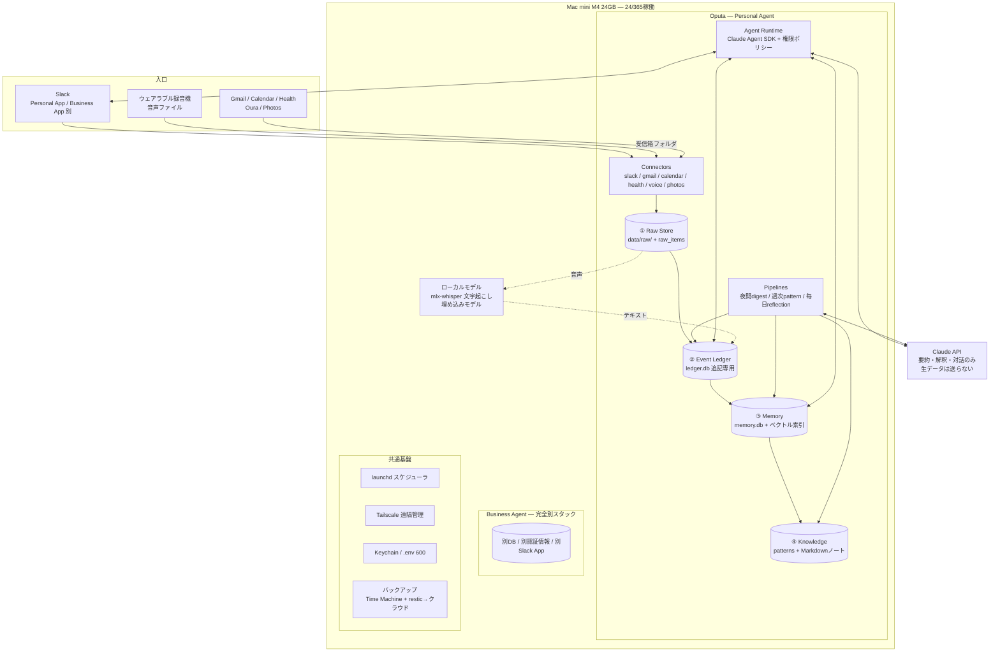

# Oputa Architecture v1

2026-08-10 版 — Mac mini 購入後の最初の90日で「面白い実験」を「毎日使うもの」に変えるための設計書。

---

## 0. 前提の確認

- 現状の資産: `ai-news-collector`(GitHub Actions で毎日稼働。収集 → Claude 要約 → Notion 保存 → Podcast 生成)。**cron + Python + Claude API + 外部サービス保存**というOputaの基本パターンはすでに実証済み。
- ハードウェア: **Mac mini M4 / 24GB / 512GB で適切**。
  - メモリ24GB: ローカル文字起こし(Whisper large-v3-turbo ≈ 3GB)+ ローカル埋め込みモデル(≈ 2GB)+ 常駐サービス群を同時に載せても余裕がある。
  - ストレージ512GB: **唯一の制約点**。終日録音の音声は月数十GBになり得るので、後述のライフサイクル方針(文字起こし後N日で生音声を削除/退避)と外付けSSD(Time Machine + 音声アーカイブ用、2TBで数万円)を前提にする。写真の原本はiCloud/みてね側に置き、Oputaはメタデータのみ持つ。
  - UPS(小型でよい)があると停電時の突然死を防げる。FileVault運用と相性が良い。

---

## 1. 設計原則(5つ)

すべての実装判断はこの5つに照らして行う。

1. **データ > モデル。** 価値の本体は10年分の人生データ。データは SQLite / ファイル / Markdown というオープンな形式で持ち、LLMはいつでも差し替えられる部品として扱う。プロンプトやポリシーもgit管理のテキストにする。
2. **事実と解釈の分離。** 「実際に起きたこと」(Event Ledger、追記専用)と「AIの解釈」(Memory / Knowledge)を物理的に別テーブルにし、解釈は必ず根拠となる事実へ遡れるようにする(provenance)。
3. **Personal と Business は最初から別スタック。** 同じMac miniに住まわせても、DB・認証情報・Slack App・プロセスを分離する。「あとで分ける」は事故のもとなので、ディレクトリ構造の段階で分けておく。
4. **生データはローカルに留める。** 音声・写真の生データはMac miniの外に出さない。文字起こし・埋め込みはローカルモデルで行い、クラウド(Claude API)に送るのは必要最小限のテキストだけ。
5. **判断は人間、実行は許可制。** Oputaの書き込み系アクション(カレンダー作成、写真投稿など)は許可リスト+Slack上の承認ボタンを最初から仕組みとして入れる。これは4.0(Act)の準備を初日からしておくということ。

---

## 2. Mac mini 内部アーキテクチャ



### ディレクトリ構造

```
/Users/oputa/
├── apps/
│   ├── oputa/                    # Personal Agent(本体・新規privateリポジトリ)
│   │   ├── agent/                # エージェントループ、プロンプト、policy.yaml
│   │   ├── connectors/           # slack / gmail / calendar / health / voice / photos
│   │   ├── pipelines/            # digest.py(夜間) patterns.py(週次) reflection.py(毎日)
│   │   ├── data/
│   │   │   ├── raw/              # 音声・エクスポートの受信箱(ライフサイクル管理対象)
│   │   │   ├── ledger.db         # SQLite: raw_items + events(追記専用)
│   │   │   ├── memory.db         # SQLite: memories + patterns + sqlite-vec索引
│   │   │   └── knowledge/        # Markdownノート(git管理)
│   │   └── logs/
│   ├── business-agent/           # 同一構造の完全別スタック(90日ではスケルトンのみ)
│   └── ai-news-collector/        # 既存ツール。最初の「住人」として移住させる
└── Library/LaunchAgents/         # launchd ジョブ定義(.plist)
```

### プロセスモデルと運用設定

| 項目 | 決定 | 理由 |
|---|---|---|
| スケジューラ | **launchd**(cronではなく) | macOS標準。スリープ復帰後の追い付き実行、KeepAliveによる常駐サービス再起動が得られる |
| 常駐プロセス | Slack Bot(Socket Mode)のみ。残りは全部スケジュールジョブ | 常駐を最小にすると障害点が減る。Socket Modeなら**自宅ルーターのポート開放が一切不要** |
| 遠隔アクセス | Tailscale(SSH + 画面共有) | MacBook/iPhoneからどこでも管理できる。インバウンド公開ゼロ |
| 電源 | スリープ無効、停電後の自動起動ON、UPS推奨 | 24/365の生命線 |
| ディスク暗号化 | FileVault ON | 人生データの箱なので盗難耐性を優先。停電後の再起動時のみ物理パスワード入力が必要になるが、頻度を考えて許容する |
| OSアップデート | 自動更新OFF、月1回の手動メンテ窓 | 勝手な再起動でFileVaultロック画面に落ちるのを防ぐ |
| 秘密情報 | エージェント別に macOS Keychain または権限600の.env | PersonalとBusinessで共有しない |

---

## 3. データアーキテクチャ(4層)

構想の「Raw → Event → Memory → Knowledge」をそのままスキーマにする。**下の層は上の層への参照を必ず持つ**(すべての解釈は事実へ、すべての事実は生データへ遡れる)。

```sql
-- ① RAW: 取り込んだ生データの台帳(実体はファイル or 外部サービス上)
CREATE TABLE raw_items (
  id          TEXT PRIMARY KEY,          -- 内容のsha256ハッシュ
  source      TEXT NOT NULL,             -- 'slack' | 'gmail' | 'voice' | 'health' ...
  kind        TEXT NOT NULL,             -- 'audio' | 'email' | 'message' | 'export' ...
  captured_at TEXT NOT NULL,             -- ISO8601
  uri         TEXT,                      -- ファイルパス or 外部URI
  meta        JSON,
  created_at  TEXT DEFAULT (datetime('now'))
);

-- ② EVENT LEDGER: 「実際に起きたこと」。追記専用。UPDATE/DELETE禁止。
--    訂正が必要なときは type='correction' のイベントを追記する。
CREATE TABLE events (
  id         INTEGER PRIMARY KEY,
  ts         TEXT NOT NULL,              -- 事象の発生時刻
  type       TEXT NOT NULL,              -- 'conversation' | 'meeting' | 'run' | 'purchase' ...
  title      TEXT NOT NULL,              -- 事実ベースの一行(例: 10:41 Aさんと次回提案について会話)
  actors     JSON,                       -- ["Aさん"]
  location   TEXT,
  raw_ids    JSON,                       -- 根拠となる raw_items.id
  source     TEXT NOT NULL,              -- どのコネクタ/人間が書いたか
  created_at TEXT DEFAULT (datetime('now'))
);

-- ③ MEMORY: AIによる解釈。必ずイベントに根拠を持つ。
CREATE TABLE memories (
  id          INTEGER PRIMARY KEY,
  statement   TEXT NOT NULL,             -- 「次回提案ではROIを提示すると約束」
  kind        TEXT NOT NULL,             -- 'fact' | 'commitment' | 'preference' | 'goal' | 'decision'
  entities    JSON,                      -- ["Aさん", "提案"] ← 人・場所・件名での横断キー
  event_ids   JSON NOT NULL,             -- 根拠イベント
  confidence  REAL,
  status      TEXT DEFAULT 'active',     -- 'active' | 'superseded' | 'expired'
  valid_until TEXT,
  embedding   BLOB                       -- sqlite-vec(意味検索用)
);

-- ④ KNOWLEDGE: 週次バッチが発見する傾向・パターン。
CREATE TABLE patterns (
  id             INTEGER PRIMARY KEY,
  statement      TEXT NOT NULL,          -- 「Aさんは定量的な投資対効果を重視する傾向」
  evidence       JSON NOT NULL,          -- 根拠となる memory_ids / event_ids
  first_seen     TEXT,
  last_confirmed TEXT,
  confidence     REAL
);

-- 写真はメタデータのみ(原本はiCloud/みてね側)
CREATE TABLE photos (
  photo_id    TEXT PRIMARY KEY,          -- Apple Photos の UUID
  taken_at    TEXT,
  people      JSON,
  location    TEXT,
  event       TEXT,
  description TEXT,                      -- AI生成キャプション(意味検索の本体)
  score       REAL,                      -- ベストショット評価
  storage_uri TEXT,
  embedding   BLOB
);
```

### 層をつなぐ3つの定期パイプライン

| パイプライン | 頻度 | 処理 | 使うモデル |
|---|---|---|---|
| digest | 毎晩 | 当日の events を読み、memories を抽出・更新(約束、決定、好み)。矛盾があれば古いmemoryを`superseded`に | Claude Haiku(安い・十分) |
| patterns | 週1 | memories/events を横断して傾向を発見し patterns へ。週次レビューの材料 | Claude Sonnet/Fable(推論力重視) |
| reflection | 毎日22:00 | 今日のイベント要約+未完の約束+明日の予定をSlackにDM | Claude Haiku〜Sonnet |

---

## 4. 技術選定

| レイヤ | 選定 | 理由 |
|---|---|---|
| 言語 | Python(uv で環境管理) | collector.py の資産と経験をそのまま活かす |
| DB | **SQLite**(+ sqlite-vec) | 個人利用=単一書き込み。運用ゼロ、バックアップはファイルコピー、10年持つ形式。PostgreSQLは同時接続が必要になってからで遅くない |
| ベクトル検索 | sqlite-vec | DBを増やさない。数十万件までは十分速い |
| 埋め込み | ローカル(multilingual-e5 系) | コストゼロ・データがローカルに留まる・M4で高速 |
| 文字起こし | **mlx-whisper**(large-v3-turbo) | Apple Silicon最適化。生音声を外に出さずに高精度な日本語文字起こし |
| 話者認識 | pyannote / WhisperX | ローカルで話者分離。精度は「本人 vs それ以外+頻出話者の学習」程度から始める |
| エージェント | Claude Agent SDK + MCP | コネクタをMCPサーバとして書けば、エージェント本体と疎結合になり、将来モデルを替えても資産が残る |
| 推論 | Claude API(digest=Haiku、reflection/patterns=Sonnet以上) | 用途でモデルを使い分けてコストを抑える |
| 入口 | Slack Bot **Socket Mode** | ポート開放不要・iPhoneからも使える・Personal/Businessで別Appにできる |
| 写真索引 | osxphotos | Apple Photosライブラリから日時・人物・位置のメタデータを安全に読める定番ツール |
| 健康データ | Health Auto Export(iPhoneアプリ)→ 共有フォルダ、Oura公式API | Apple Healthは公式のサーバAPIがないため、エクスポートアプリ経由が現実解 |
| みてね投稿 | Playwright によるブラウザ操作(人間の承認後に実行) | 公開APIがないため。壊れやすい前提で、投稿前に必ずSlackで承認を挟む |
| バックアップ | Time Machine(外付けSSD)+ restic → Backblaze B2(暗号化) | 後述。これは機能ではなく製品の本体 |

---

## 5. Personal / Business 分離の実装

```
分離するもの                          共有するもの
─────────────────                    ─────────────────
データベース(ファイル自体を別)          Mac mini本体・macOSアカウント
data/ ディレクトリ                    launchd・Tailscale・バックアップ基盤
APIキー・トークン(Keychain項目別)      ローカルモデル(whisper・埋め込み)
Slack App(Bot 2つ)                   コードの共通ライブラリ(pip package化)
エージェントのプロンプト・権限ポリシー
```

- 実装上は「同じフレームワーク、別インスタンス」。`oputa/` と `business-agent/` は同じコード基盤を使うが、設定・データ・認証情報が交わる箇所をゼロにする。
- 最初の90日で Business Agent は**作らない**。ただしディレクトリと別Slack Appの登録だけ済ませておき、「Personalに仕事データを入れない」規律を最初から強制する。

---

## 6. バックアップ(最重要コンポーネント)

「10年分の人生データがあれば将来最強のAIに接続できる」という構想の裏返しは、**データ消失=Oputaの死**ということ。機能より先に整える。

1. **Time Machine** → 外付けSSD(ローカル・毎時)
2. **restic** → Backblaze B2 等(暗号化・毎晩、`data/` と `knowledge/` を対象)
3. SQLiteは毎晩 `VACUUM INTO` でスナップショットを取ってからresticに含める(破損対策)
4. **四半期に1回、リストア訓練**をやる(復元できないバックアップはバックアップではない)

生音声のライフサイクル: 文字起こし完了後、生ファイルは**30日で外付けSSDへ退避、90日で削除**(初期値。運用しながら調整)。Ledger/Memoryは永久保持。

---

## 7. 90日アクションプラン

順番は構想どおり「①Ledger → ②Slack → ③Calendar/Gmail → ④音声 → ⑤写真 → ⑥Daily Reflection」。各フェーズに「完了の定義(DoD)」を置き、**前のソースを週次で使う習慣がつくまで次のソースを増やさない**。

### Phase 0 — 立ち上げ(Week 0、Mac mini到着週)

- macOSセットアップ: FileVault、スリープ無効、停電後自動起動、自動更新OFF
- Tailscale導入(MacBook/iPhoneから疎通確認)、Time Machine + restic 稼働開始
- 新規privateリポジトリ `oputa` 作成(このリポジトリとは分ける)
- **ai-news-collector を最初の住人として移住**: GitHub Actions から launchd へ。個人データを一切含まない既存ワークロードで、launchd・ログ・秘密情報管理・ネットワークという運用一式を検証できる、理想的な「カナリア」
- DoD: collector が Mac mini 上で3日連続自動実行され、Notionに記事が届く

### Phase 1 — ① Life Event Ledger(Week 1–2)

- `raw_items` / `events` スキーマ実装、追記専用の規律をコードで強制
- CLI `oputa log "昼にAさんとランチ、次回提案の話"` で手動イベント記録
- 手動でいいから毎日使い始める(データが貯まり始める日=Oputa誕生日)
- DoD: 30件以上のイベントが記録され、日付・人物で検索できる

### Phase 2 — ② Slack(Week 3–4)

- Personal用Slack App(Socket Mode)。DMでイベント記録・質問応答
- 「今週何してたっけ?」に ledger から答えられるようにする(Agent SDK + 検索ツール)
- **reflectionのβ版**をここで前倒し: 毎晩「今日のイベント一覧」をDMするだけの素朴な版。毎日触る理由を早期に作る
- DoD: iPhoneのSlackから記録と質問が日常的にできる

### Phase 3 — ③ Calendar / Gmail(Week 5–6)

- 読み取り専用コネクタ: 予定と重要メールを events 化(専用Googleアカウント or 絞ったOAuthスコープ)
- 夜間 digest パイプライン稼働開始: events → memories(約束・決定の抽出)
- 埋め込み+sqlite-vec で意味検索(「先月の保険の話どこだっけ」)
- DoD: 「来週の予定と、関連して覚えておくべきこと」に答えられる

### Phase 4 — ④ 音声(Week 7–9)

- **先に運用ポリシーを文書化**: 録音同意の取り方、対象外にする相手・場面、生音声の保持期間、機密ワードの扱い。コードより先に書く
- 受信箱フォルダ監視 → mlx-whisper 文字起こし → 話者分離 → 会話イベント+memory抽出
- まず会議・音声メモなど「同意が自明な場面」から。終日録音はポリシーと精度に納得してから
- DoD: 音声ファイルを置くと10分以内に「誰と何を話したか」がledgerに載る

### Phase 5 — ⑤ 写真(Week 10–11)

- osxphotos で Apple Photos のメタデータを `photos` テーブルへ索引(原本はコピーしない)
- ベストショット選定パイプライン(重複・ピンボケ除外 → 表情・構図スコアリング)
- みてね投稿は Playwright で自動化し、**投稿前に必ずSlackで候補を見せて承認ボタン** — これが「4.0 Act」の許可制実行の最初の実例になる
- DoD: 「この旅行のベスト10をみてねに」が承認1タップで完了する

### Phase 6 — ⑥ Daily Reflection 完成(Week 12)

- 毎日22:00: 今日の出来事+未完の約束+明日の注意点
- 日曜: 週次レビュー(patterns パイプライン初版。目標に対する時間の使い方を含む)
- DoD: **リフレクションを7日連続で「読みたくて」読んだら、Oputaは日用品になったと判定**

### 90日後の判定基準

- 「先週何してた?」に正確に答えられる(= Oputa 1.0 Remember の達成)
- Daily Reflection が習慣になっている
- データが1日も欠けずバックアップされている

---

## 8. リスクと対策

| リスク | 対策 |
|---|---|
| データ消失 | §6のバックアップを機能開発より先に。リストア訓練を四半期ごとに |
| 録音をめぐる信頼問題 | Phase 4の前にポリシー文書化。同意の取れない場面は録らない。生音声の短期削除、話者ごとのopt-outリスト |
| 512GBの枯渇 | 音声ライフサイクル+外付けSSD。写真原本を持たない設計を守る |
| みてね自動化の破綻 | ブラウザ操作は壊れる前提。人間承認を挟むので誤爆はしない。壊れたら直すまで手動に戻すだけ |
| スコープクリープ | 「前のソースが週次で使われるまで次を作らない」ルール。Business Agentは90日スコープ外 |
| モデル/ベンダーロックイン | データはSQLite+Markdown、コネクタはMCP、プロンプトはgit。モデルは設定1行で差し替え可能に保つ |
| クラウドへ送るデータ | 生音声・写真は送らない。APIへはテキストの必要最小限のみ。送信内容をログで監査可能にする |

---

## 9. 1.0 → 4.0 への接続

この設計は最初から進化の置き場所を用意してある。

- **1.0 Remember** = 90日プランそのもの(ledger + 意味検索 + reflection)
- **2.0 Understand** = patterns パイプラインの拡張。`entities`(人・場所)と時刻がすべての層に入っているので、「旅行前は睡眠が短い」のような横断分析はSQL+LLMで書ける
- **3.0 Predict** = ledger から特徴量(睡眠・運動量・予定密度)を引く。まずヒューリスティクス(「今週の予定密度が過去平均の1.5倍」)から始め、MLは必要になってから
- **4.0 Act** = policy.yaml の許可リストを段階的に広げるだけ。承認ボタン付き実行の仕組みは Phase 5(みてね投稿)で実戦投入済み

---

## 10. このリポジトリとの関係

- `ai-news-collector` は独立したツールとして存続し、Phase 0 で Mac mini に移住して「学習(記事・Podcast)」系の最初のデータソース兼、運用のカナリアになる。
- Oputa 本体は新規 private リポジトリ `oputa` で開発する(人生データに関わる設計・プロンプトを含むため)。
- この設計書は出発点としてここに置くが、以後の更新は `oputa` リポジトリ側で行う。
